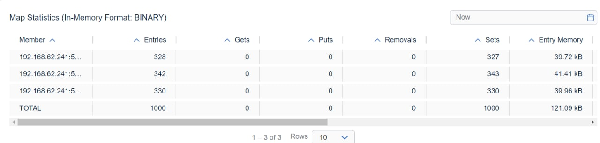
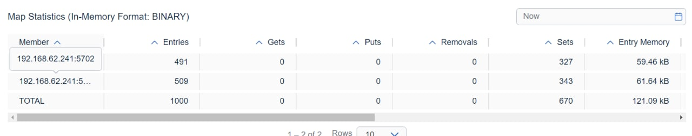
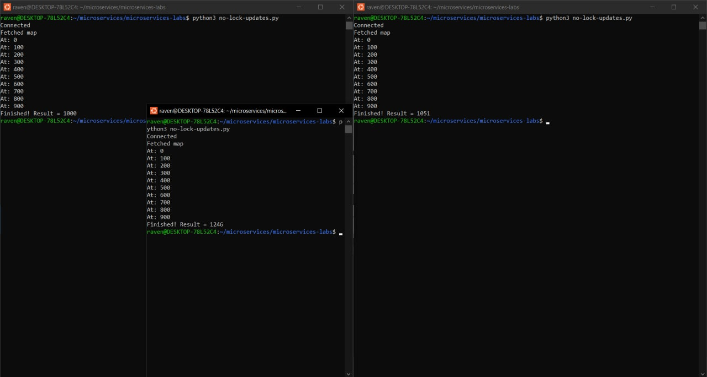
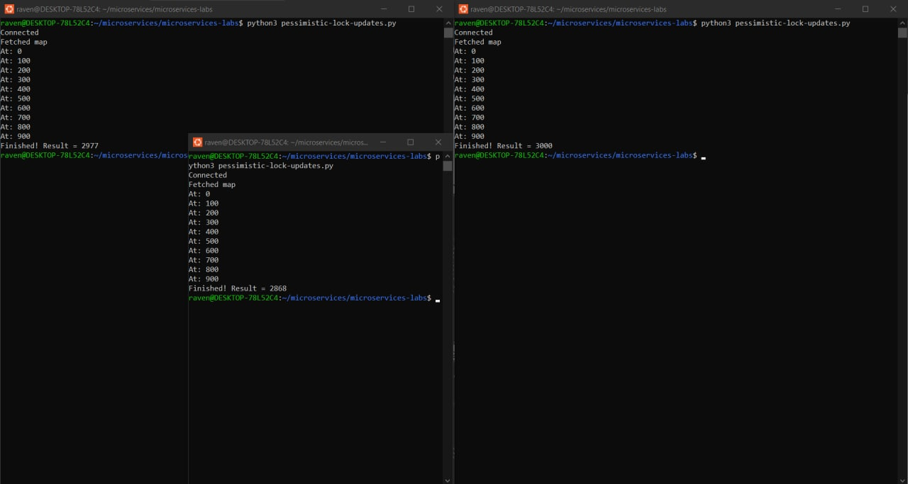
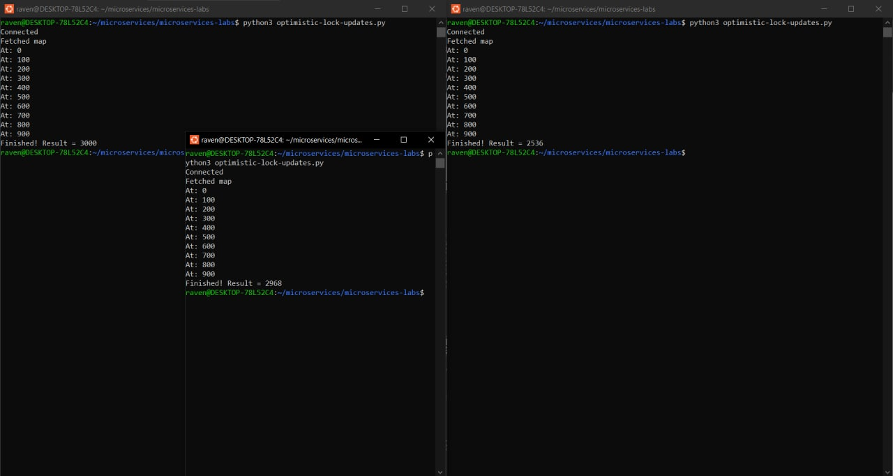
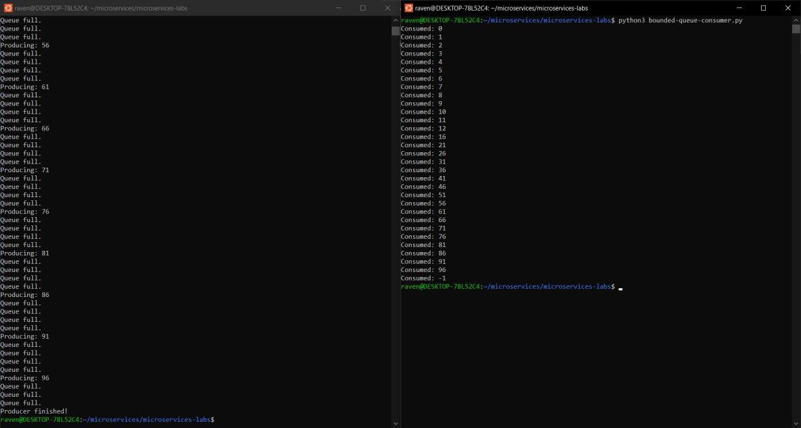

# Lab 3: Microservies with Hazelcast Distributed Map

### Disclaimer

Sorry for the low quality of some larger screenshots, I accidentally saved them in lower resolution and only noticed when writing this report... My apologies.

## Report

### Task 1

After filling the map with `dist_map_fill.py`, the data was distributed evenly among the 3 cluster nodes:

When the 3rd node got removed unexpectedly, the other two split the load - and didn't lose any data in the process:

Same worked when only leaving 1 node up:

### Task 2

Without any locks, almost all calls from the 3 clients overlapped, and the total result barely got over a thousand (despite 3 thousand actual +1 operations happening):

Pessimistic locking got the job done (the final result is 3000), but took a while to finish:

Optimistic locking worked just as well, while also performing better:

### Task 3

Setting the queue size limit to 10 (done in `hazelcast.xml`, copied to this repository for readers convenience) resulted in the producer skipping 80% of the item creations, once the queue filled up. In total, only 30 out of 100 items were produced and consumed.

Note: It is possible to implement two kinds of producer logic, which are
- if queue is full, wait until something gets taken out of it then produce this item
- if queue is full, skip producing this item

I went with the first approach, although both would explain the bounded queue. The first approach is just faster :D

