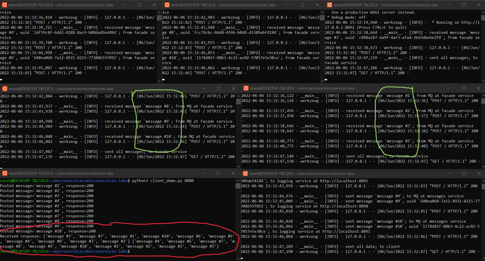
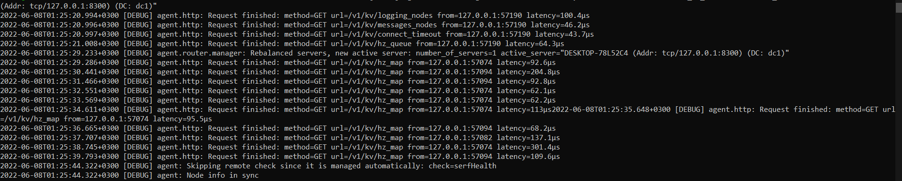
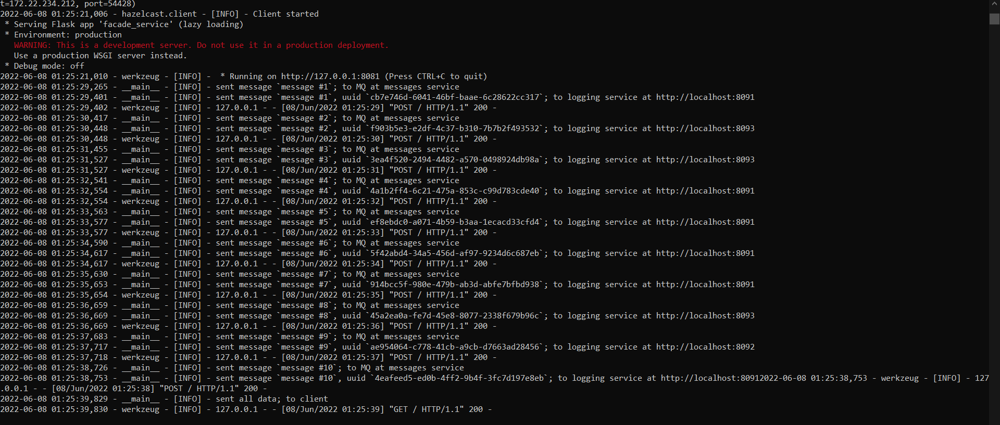
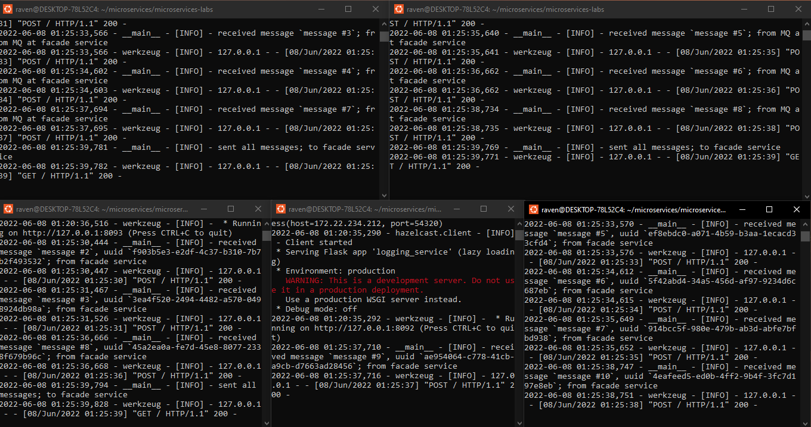

# Lab 5: Microservies with Consul

## Report

There is less to show in this lab, but here we can see that the result of the demo is unchanged:

Looking at Consul logs, we can notice how all 3 microservices (over 6 instances) are using Consul:

### Service logs

All of the facade logs are also available to confirm previous information:

Finally, you can check out the backend service logs (if you wish so), but they are certainly less readable:

## Conclusion

This was a genuinely fun lab series! Thank you for taking the time to work with all of us on this and develop an interesting system.
