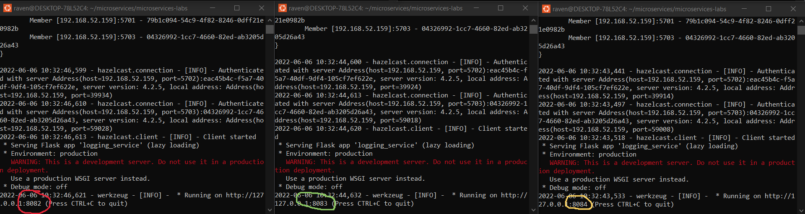
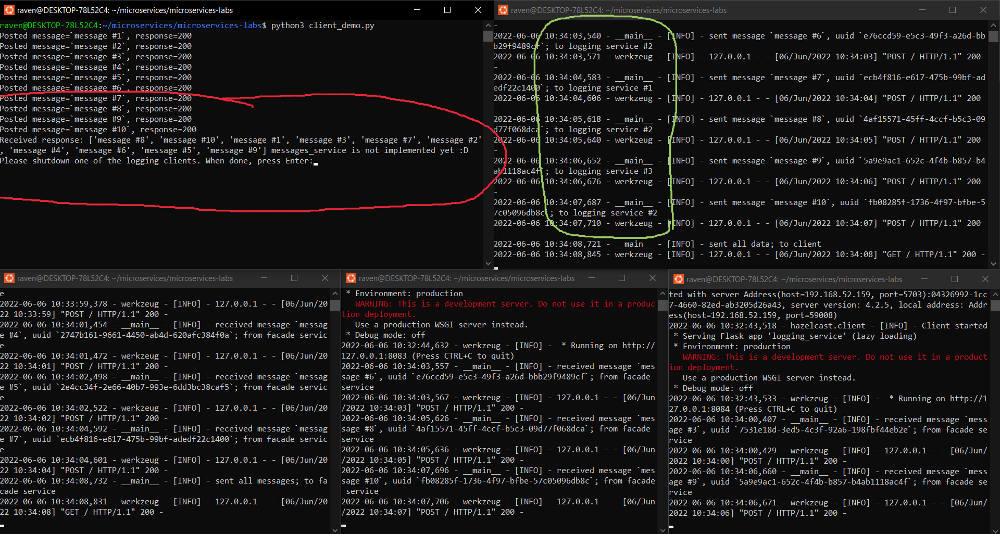
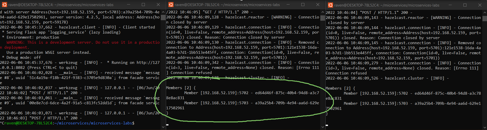
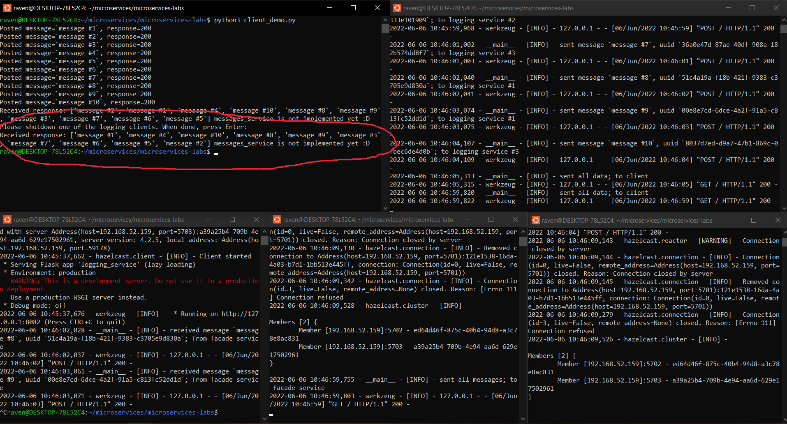
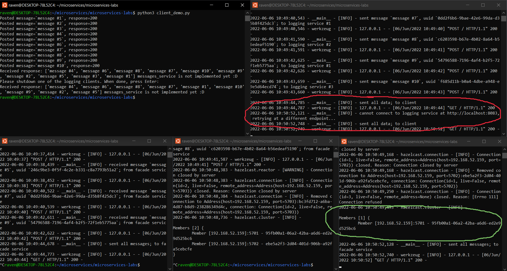

# Lab 3: Microservies with Hazelcast Distributed Map

## Report

### Part 1

The logging service is hosted on 3 different ports, indicated as the argument to `logging_service.py` (i.e. `logging_service.py 8083`):

### Part 2

Launching the demo, we can see how the messages are being randomly distributed among the logging services (highlighted in green):

Then, of course, all of them can be found via a GET request, seen in red.

### Part 3

Killing one of the `logging_service.py` processes removes a node from the cluster, since that node was created and tied with the logging process:

Afterwards, requesting the data again returns all of it, indicating that nothing was lost:

### Appendix

A situation is possible where the facade randomly tries to connect to the specific logging node that was removed. In that case, it will remove it from the list of possible connections and retry.

In the screenshot below, I killed two of the logging processes for a greater chance of a connection error (seen in green, only 1 node left). When the facade service tries to connect, it picks one of the killed logging nodes and has to retry (in red).

