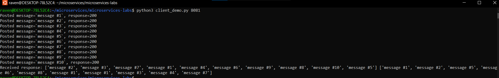

# Lab 4: Microservies with MQ (Hazelcast Distributed Queue)

## Report

Since the system is getting larger, let us take a look at the initialization process:

After running the demo, we can see that all 10 messages were recovered. (in red)

In green are logs of both messages services, indicating what messages did they consume through the queue.

You can also see other logs, although that is not required.

## GET request idea

Instead of choosing instances of `messages_service` randomly, I do a GET request on each of them and combine the results, since we would have done that anyway to get all the data. I do this inside `facade_service.py`.